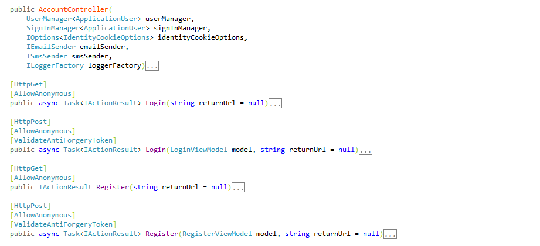
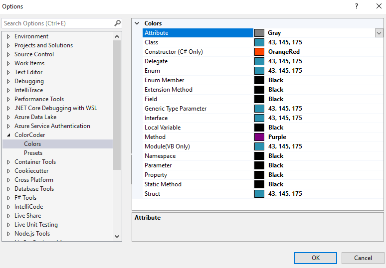
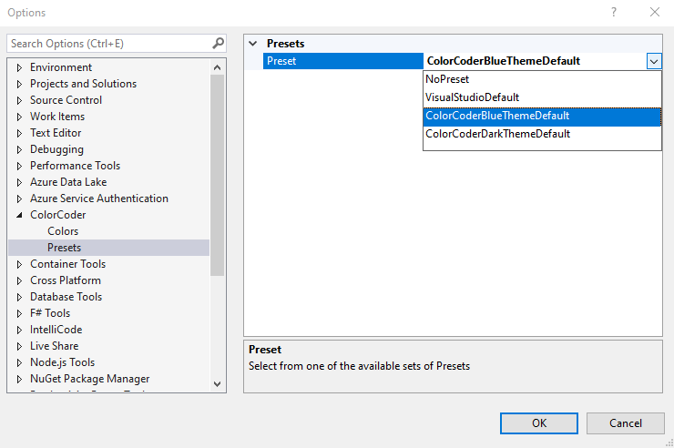

# Color Coder

Color Coder is a lightweight extension for Visual Studio 2019 and 2022. It can help you change the color of various programming constructs, such as:
      
* EnumMember          
* Constructor (C# Only)       
* Field               
* LocalVariable       
* Namespace           
* Method              
* StaticMethod        
* ExtensionMethod     
* Property            
* Parameter           
* Module (VB Only)              
* Interface           
* Class               
* Attribute 
* Struct              
* Enum                
* Delegate            
* GenericTypeParameter

When you initially install Color Coder, it doesn't change the colors, you should go to its option page to change it, you can see an example of its use on methods and constructors down below:

You can change the colors through Color Coder's options page:

You can also change the colors by selecting from a set of predefined options or restore the colors to visual studio default:

([More Info](http://hamidmosalla.com/color-coder))

# Release Notes

## Version 1 (**2017-06-16**)
- Initial release

## Version 1.0.1 (**5/21/2018**)
- Fix compatibility issues with Visual Studio 2017 (Version 15.7)
- Remove the preexisting font size for methods
- Performance improvements

## Version 1.0.2 (**4/12/2019**)
- Make Color Coder compatible with Visual Studio 2019
- Fix coloring issue related to the generic methods that returns the type parameter

## Version 1.1.0 (**08/02/2020**)
- Fix the default color issue for the dark theme
- Add a new preset for the dark theme

## Version 2.0.0 (**07/26/2021**)
- Fix the compatibility issue with Visual Studio 2019 v16.5 onward (This is a breaking change, that means extension does not work with previous versions)
- This version also adds the possibility to change the color of Attributes
