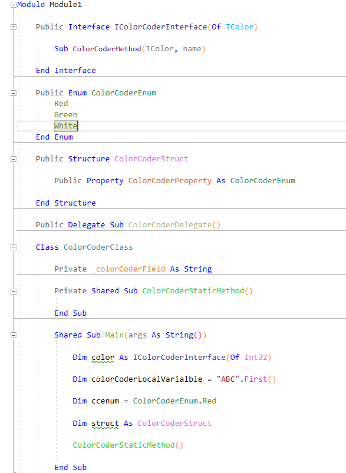

# Color Coder
Color Coder is an extension for Visual Studio 2015 and 2017. 
It helps you reduce the cognitive load of reading codes by coloring various programming constructs.
 These are:
      
* EnumMember          
* Constructor (C# Only)       
* Field               
* LocalVariable       
* Namespace           
* Method              
* StaticMethod        
* ExtensionMethod     
* Property            
* Parameter           
* Module (VB Only)              
* Interface           
* Class               
* Struct              
* Enum                
* Delegate            
* GenericTypeParameter

Code colors in C#:

Code colors in VB.Net:

You can change the colors through Visual Studio's options page:

